# Codex Labs

Four progressive labs for practicing code generation with the OpenAI Codex CLI. Each lab builds on the previous one and assumes you are working inside the Codex Docker container from the project README, where your local `./src` folder is mounted to `/usr/src,/app/src` inside the container.

## Architecture Overview

```mermaid
graph TB
    User["👤 User"]
    
    subgraph Host["Host Environment"]
        HostFS["Host OS<br/>./src"]
    end
    
    subgraph Docker["Docker Secured Container"]
        subgraph ContainerOS["Container OS"]
            Codex["Codex CLI"]
            ContainerFS["Container Filesystem<br/>/usr/src/app/src"]
        end
    end
    
    subgraph Cloud["Azure Cloud"]
        OpenAI["OpenAI API<br/>(Azure)"]
    end
    
    User -->|Edits Files| HostFS
    User -->|Docker Exec| Codex
    HostFS -.->|Volume Mount| ContainerFS
    Codex <-->|HTTPS API Calls| OpenAI
    
    style Docker fill:#e1f5ff,stroke:#0078d4,stroke-width:3px
    style Host fill:#f0f0f0,stroke:#666,stroke-width:2px
    style Cloud fill:#fff4e1,stroke:#ff9800,stroke-width:2px
    style ContainerOS fill:#cceeff,stroke:#0078d4,stroke-width:2px
    style User fill:#d4edda,stroke:#28a745,stroke-width:2px
```

- [Lab 1: Hello Codex Code Generation](lab1-hello-world.md)
- [Lab 2: Guiding Codex with AGENTS.md](lab2-agents.md)
- [Lab 3: Working with an Existing Code Base](lab3-existing-codebase.md)
- [Lab 4: Multi-Codex Coordination with tmux](lab4-multi-codex-tmux.md)
