# Lab 1: Hello Codex Code Generation

<p align="center">
  <strong>👤 User:</strong> <em>"Create a hello world application"</em> → 
</p>

Start with a minimal command that asks Codex to write and run a "hello world" program so you can verify the CLI, container mount, and environment.

## Architecture & Workflow

```mermaid
graph TB
    User["👤 User"]
    
    subgraph Host["Host Environment"]
        HostFS["Host Filesystem<br/>./src/code/"]
    end
    
    subgraph Docker["Docker Secured Container"]
        subgraph ContainerOS["Container OS"]
            Codex["<img src='../uni-dev.png' width='30' /><br/>Codex CLI"]
            ContainerFS["Container Filesystem<br/>/usr/src/code/"]
        end
    end
    
    subgraph Cloud["Azure Cloud"]
        OpenAI["Codex Model<br/> (Azure Foundry)"]
    end
    
    User -.->|"② codex 'Create lab1_hello.py...'"| Codex
    Codex -->|"③ Send prompt"| OpenAI
    OpenAI -->|"④ Return code"| Codex
    Codex -->|"⑤ Write lab1_hello.py"| ContainerFS
    ContainerFS -.->|"⑥ Volume Mount (sync)"| HostFS
    User -.->|"⑧ python lab1_hello.py"| HostFS
    
    style Docker fill:#e1f5ff,stroke:#0078d4,stroke-width:3px,color:#000
    style Host fill:#f0f0f0,stroke:#666,stroke-width:2px,color:#000
    style Cloud fill:#fff4e1,stroke:#ff9800,stroke-width:2px,color:#000
    style ContainerOS fill:#cceeff,stroke:#0078d4,stroke-width:2px,color:#000
    style User fill:#d4edda,stroke:#28a745,stroke-width:2px,color:#000
```



**Workflow Steps:**
1. User launches Docker container with mounted volume
2. User issues Codex command to create Python script
3. Codex sends prompt with context to Azure OpenAI
4. Azure OpenAI returns generated code
5. Codex writes `lab1_hello.py` to container filesystem
6. File automatically syncs to host via volume mount
7. User executes the script inside container
8. User verifies file exists on host machine

## Goal
- Generate and run your first Codex-created script.

## Prerequisites
- Docker image built from this repo and `.env` configured.
- Container shell started with `docker compose run codex /bin/bash` so your local `./src` is mounted to `/usr/src/app/src`.

## Steps
1. Launch the container if you are not already inside:
   ```bash
   docker compose run codex /bin/bash
   ```
2. Ask Codex to create a simple Python script under the mounted `src` folder:
   ```bash
   codex "Create src/code/lab1_hello.py that prints 'Hello Codex' when run as a script. Use a main() function and call it under the usual __main__ guard."
   ```
3. Inspect the generated file:
   ```bash
   sed -n '1,80p' src/code/lab1_hello.py
   ```
4. Run the program to confirm it works:
   ```bash
   python src/code/lab1_hello.py
   ```
5. Optional: from your host machine, confirm the same file appears under `./src/code/lab1_hello.py` to verify the mount is working.
6. Iterate by asking Codex to accept a `--name` argument and personalize the greeting.

## What to Observe
- Codex writes files directly into `src/code`, which is mounted from your host.
- The command prompt can mix creation instructions and validation steps.
- Host and container views of `./src` stay in sync, verifying the mount.
