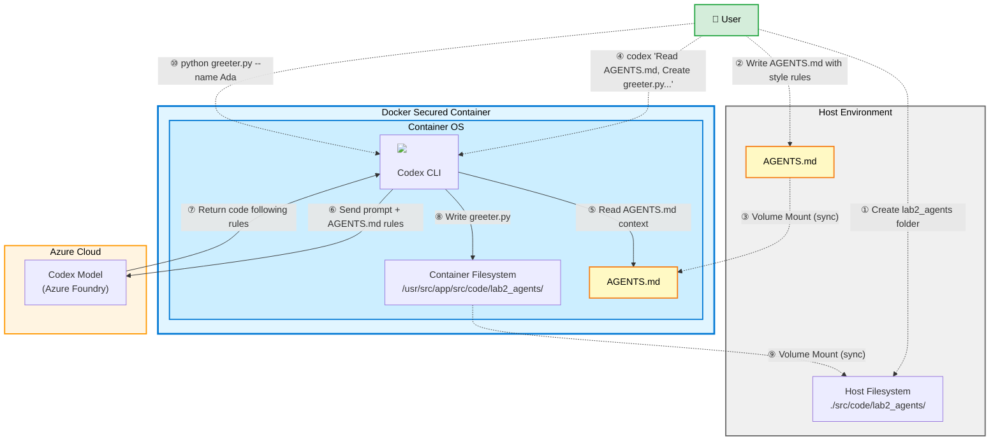

# Lab 2: Guiding Codex with AGENTS.md

<p align="center">
  <strong>👤 User:</strong> <em>"Create some code for me but follow these instructions"</em> + 📄 <strong>AGENTS.md</strong> → 
</p>

Teach Codex how you want code to look by adding an `AGENTS.md` file that sets conventions for a folder before asking it to generate new code.

## Architecture & Workflow



**Workflow Steps:**
1. User creates lab2_agents folder on host
2. User writes AGENTS.md with coding style preferences and rules
3. AGENTS.md syncs to container via volume mount
4. User issues Codex command with explicit instruction to read AGENTS.md
5. Codex reads AGENTS.md to understand coding conventions
6. Codex sends prompt to Azure OpenAI including AGENTS.md rules as context
7. Azure OpenAI returns generated code that follows the specified rules
8. Codex writes `greeter.py` to container filesystem
9. Generated file syncs to host via volume mount
10. User executes the script to verify it follows AGENTS.md conventions

## Goal
- Capture coding preferences in `AGENTS.md` and see Codex follow them.

## Prerequisites
- Lab 1 completed and container shell open at `/usr/src/app` via `docker compose run codex /bin/bash`.
- Local `./src` folder is mounted to `/usr/src/app/src` inside the container.

## Steps
1. Create a dedicated workspace for this lab (the folder will be visible both inside the container and on your host under `./src/code/lab2_agents`):
   ```bash
   mkdir -p src/code/lab2_agents
   ```
2. Add an `AGENTS.md` file that describes the style you want Codex to follow:
   ```bash
   cat <<'EOF' > src/code/lab2_agents/AGENTS.md
   # Lab 2 Agent Instructions
   - Prefer Python 3.11 scripts placed in this folder.
   - Include a short module docstring and a `main()` guarded by `if __name__ == "__main__"`.
   - Use `argparse` for command-line parsing when arguments are needed.
   - Avoid inline comments; keep the code self-explanatory.
   EOF
   ```
3. Ask Codex to generate a program that honors those instructions:
   ```bash
   codex "Read src/code/lab2_agents/AGENTS.md. Create src/code/lab2_agents/greeter.py that exposes greet(name: str) -> str and a CLI flag --name (default 'Codex') to print the greeting."
   ```
4. Inspect and run the result to confirm the agent guidance took effect:
   ```bash
   sed -n '1,160p' src/code/lab2_agents/greeter.py
   python src/code/lab2_agents/greeter.py --name Ada
   ```
5. Experiment: change the `AGENTS.md` rules (for example, ask for type hints everywhere or a different language) and regenerate to see how the output shifts.

## What to Observe
- Agent rules apply to the directory tree containing the `AGENTS.md` file.
- Persistent preferences reduce how much you must repeat in each prompt.
- Files appear in both the container path (`/usr/src/app/src/code/lab2_agents`) and the host path (`./src/code/lab2_agents`), confirming the mount.
