# Lab 3: Working with an Existing Code Base


<p align="center">
  <strong>👤 User:</strong> <em>"Extend this code"</em> + 📄 <strong>AGENTS.md</strong> →  ← 📁 <strong>Existing Codebase</strong>
</p>

Use Codex to extend or refactor code that already exists on disk. This lab keeps the context in `src/code` so Codex can read and modify files directly.

## Architecture & Workflow

```mermaid
graph TB
    User["👤 User"]
    
    subgraph Host["Host Environment"]
        HostFS["Host Filesystem<br/>./src/code/lab3_orders/"]
        ExistingCode["order_service.py<br/>(existing)"]
    end
    
    subgraph Docker["Docker Secured Container"]
        subgraph ContainerOS["Container OS"]
            Codex["<img src='../uni-dev.png' width='30' /><br/>Codex CLI"]
            ContainerFS["Container Filesystem<br/>/usr/src/app/src/code/lab3_orders/"]
            ExistingFS["order_service.py<br/>(existing)"]
        end
    end
    
    subgraph Cloud["Azure Cloud"]
        OpenAI["Codex Model<br/> (Azure Foundry)"]
    end
    
    User -.->|"① Create lab3_orders folder"| HostFS
    User -.->|"② Write initial order_service.py"| ExistingCode
    ExistingCode -.->|"③ Volume Mount (sync)"| ExistingFS
    User -.->|"④ codex 'Review order_service.py, Add discounts...'"| Codex
    Codex -->|"⑤ Read existing code"| ExistingFS
    Codex -->|"⑥ Send prompt + existing code context"| OpenAI
    OpenAI -->|"⑦ Return modified/extended code"| Codex
    Codex -->|"⑧ Update order_service.py in place"| ExistingFS
    ExistingFS -.->|"⑨ Volume Mount (sync)"| ExistingCode
    User -.->|"⑩ python order_service.py"| Codex
    User -.->|"⑪ Review changes on host"| ExistingCode
    
    style Docker fill:#e1f5ff,stroke:#0078d4,stroke-width:3px,color:#000
    style Host fill:#f0f0f0,stroke:#666,stroke-width:2px,color:#000
    style Cloud fill:#fff4e1,stroke:#ff9800,stroke-width:2px,color:#000
    style ContainerOS fill:#cceeff,stroke:#0078d4,stroke-width:2px,color:#000
    style User fill:#d4edda,stroke:#28a745,stroke-width:2px,color:#000
    style ExistingCode fill:#ffccbc,stroke:#d84315,stroke-width:2px,color:#000
    style ExistingFS fill:#ffccbc,stroke:#d84315,stroke-width:2px,color:#000
```



**Workflow Steps:**
1. User creates lab3_orders folder on host
2. User writes initial order_service.py with basic Order class and methods
3. Existing code syncs to container via volume mount
4. User issues Codex command to review and extend existing code
5. Codex reads the existing order_service.py code and structure
6. Codex sends prompt to Azure OpenAI including existing code as context
7. Azure OpenAI returns modified/extended code that preserves existing structure
8. Codex updates order_service.py in place (not creating a new file)
9. Modified file syncs back to host via volume mount
10. User executes the updated script to verify new features
11. User reviews the changes on host machine to confirm preservation of structure

## Goal
- Have Codex evolve an existing project instead of starting from scratch.

## Prerequisites
- Lab 2 completed. Keep `src/code/lab2_agents/AGENTS.md` nearby if you want the same conventions.
- Container shell open at `/usr/src/app` (`docker compose run codex /bin/bash`) with local `./src` mounted to `/usr/src/app/src`.

## Steps (Python Example)
1. Create a small starter module for Codex to work with (visible on host at `./src/code/lab3_orders` and in the container at `/usr/src/app/src/code/lab3_orders`):
   ```bash
   mkdir -p src/code/lab3_orders
   cat <<'EOF' > src/code/lab3_orders/order_service.py
   from dataclasses import dataclass
   from typing import Iterable

   @dataclass
   class Order:
       id: str
       items: list[float]
       tax_rate: float = 0.07

       def subtotal(self) -> float:
           return sum(self.items)

       def total(self) -> float:
           return round(self.subtotal() * (1 + self.tax_rate), 2)


   def main() -> None:
       sample = Order(id="A1", items=[9.99, 12.50, 1.00])
       print(f"Order {sample.id} total: ${sample.total():.2f}")


   if __name__ == "__main__":
       main()
   EOF
   ```
2. Ask Codex to read the file and add features (discount codes, CSV export, or tests):
   ```bash
   codex "Review src/code/lab3_orders/order_service.py. Add support for percentage discounts and a CLI that loads item prices from a JSON file path. Keep the existing structure and update the file in place."
   ```
3. Validate and run the updated code:
   ```bash
   sed -n '1,200p' src/code/lab3_orders/order_service.py
   python src/code/lab3_orders/order_service.py orders.json   # adjust per Codex output
   ```
4. Ask Codex for focused changes, such as generating unit tests or adding logging, by referencing the specific functions you want touched.

## Alternative (C#)
- Replace the starter file with a small C# console app under `src/code/lab3_orders/Program.cs` and prompt Codex to extend it (e.g., add models, services, and tests). The workflow mirrors the Python steps.

## What to Observe
- Codex respects the existing structure and naming when asked to work in place.
- Referencing files explicitly keeps Codex anchored to real code instead of inventing new layouts.
- Any changes Codex makes inside the container appear immediately on your host under `./src`, confirming the shared mount.
