# Lab 4: Multi-Codex Coordination with tmux

<p align="center">
  <strong>👤 User:</strong> <em>"Coordinate multiple tasks"</em> + 📄 <strong>AGENTS.md</strong> →    ← 📁 <strong>Shared Codebase</strong>
</p>

Run several Codex sessions side-by-side with `tmux` so you can generate code, review output, and run commands in parallel.

## Architecture & Workflow

```mermaid
graph TB
    User["👤 User"]
    
    subgraph Host["Host Environment"]
        HostFS["Host Filesystem<br/>./src/code/lab4_tmux/"]
        CoordFile["AGENTS.md<br/>(coordination)"]
    end
    
    subgraph Docker["Docker Secured Container"]
        subgraph Tmux["tmux Session"]
            subgraph PaneA["Pane A: Planner"]
                CodexA["<img src='../uni-dev.png' width='30' /><br/>Codex CLI A"]
            end
            subgraph PaneB["Pane B: Builder"]
                CodexB["<img src='../uni-dev.png' width='30' /><br/>Codex CLI B"]
            end
            subgraph PaneC["Pane C: Runner"]
                CodexC["<img src='../uni-dev.png' width='30' /><br/>Codex CLI C"]
            end
            ContainerFS["Shared Container FS<br/>/usr/src/app/src/code/"]
            CoordFS["AGENTS.md<br/>(coordination)"]
        end
    end
    
    subgraph Cloud["Azure Cloud"]
        OpenAI["Codex Model<br/> (Azure Foundry)"]
    end
    
    User -.->|"① Start tmux session"| Tmux
    User -.->|"② Create lab4_tmux folder & AGENTS.md"| CoordFile
    CoordFile -.->|"③ Volume Mount (sync)"| CoordFS
    User -.->|"④ Split into 3 panes"| Tmux
    
    CodexA -.->|"⑤ Read/Edit AGENTS.md"| CoordFS
    CodexA -.->|"⑥ Plan tasks"| CoordFS
    
    CodexB -->|"⑦ Read AGENTS.md + prompts"| CoordFS
    CodexB -->|"⑧ Send build request"| OpenAI
    OpenAI -->|"⑨ Return code"| CodexB
    CodexB -->|"⑩ Write code files"| ContainerFS
    
    CodexC -->|"⑪ Execute tests/code"| ContainerFS
    CodexC -.->|"⑫ Log results"| CoordFS
    
    ContainerFS -.->|"⑬ Volume Mount (sync all changes)"| HostFS
    CoordFS -.->|"⑬ Volume Mount (sync coordination)"| CoordFile
    
    style Docker fill:#e1f5ff,stroke:#0078d4,stroke-width:3px,color:#000
    style Host fill:#f0f0f0,stroke:#666,stroke-width:2px,color:#000
    style Cloud fill:#fff4e1,stroke:#ff9800,stroke-width:2px,color:#000
    style Tmux fill:#b3e5fc,stroke:#01579b,stroke-width:2px,color:#000
    style PaneA fill:#c8e6c9,stroke:#2e7d32,stroke-width:2px,color:#000
    style PaneB fill:#fff9c4,stroke:#f57f17,stroke-width:2px,color:#000
    style PaneC fill:#ffccbc,stroke:#d84315,stroke-width:2px,color:#000
    style User fill:#d4edda,stroke:#28a745,stroke-width:2px,color:#000
    style CoordFile fill:#e1bee7,stroke:#6a1b9a,stroke-width:2px,color:#000
    style CoordFS fill:#e1bee7,stroke:#6a1b9a,stroke-width:2px,color:#000
```



**Workflow Steps:**
1. User starts a tmux session inside the container
2. User creates lab4_tmux folder and coordination AGENTS.md file on host
3. Coordination file syncs to container via volume mount
4. User splits tmux into 3 panes (Planner, Builder, Runner)
5. **Pane A (Planner)**: Codex reads and edits AGENTS.md for task planning
6. **Pane A (Planner)**: Defines next tasks and coordination rules in AGENTS.md
7. **Pane B (Builder)**: Codex reads AGENTS.md and task instructions
8. **Pane B (Builder)**: Sends code generation request to Azure OpenAI
9. **Pane B (Builder)**: Receives generated code from Azure
10. **Pane B (Builder)**: Writes code files to shared container filesystem
11. **Pane C (Runner)**: Executes tests or runs generated code
12. **Pane C (Runner)**: Logs test results and outcomes back to AGENTS.md
13. All changes sync bidirectionally between container and host via volume mount

**Key Coordination Pattern:**
- All three Codex panes share the same filesystem via tmux in one container
- AGENTS.md acts as the coordination hub for task management
- Panes operate concurrently but stay synchronized through shared AGENTS.md
- Changes made by any pane are immediately visible to all other panes

## Goal
- Coordinate planning, generation, and validation across multiple Codex panes.

## Prerequisites
- Labs 1–3 completed and a container shell open at `/usr/src/app` (`docker compose run codex /bin/bash`).
- Local `./src` mounted to `/usr/src/app/src` so every tmux pane sees the same files.

## Steps
1. Start a dedicated tmux session:
   ```bash
   tmux new -s codex-labs
   ```
2. Split the workspace into panes for different roles:
   - New window: `Ctrl+b` then `c` (useful for a fresh Codex chat).
   - Vertical split: `Ctrl+b` then `%`.
   - Horizontal split: `Ctrl+b` then `"`.
3. Add a tmux coordination `AGENTS.md` that all Codex sessions will follow (create once; all panes share it via the mounted `./src`):
   ```bash
   mkdir -p src/code/lab4_tmux
   cat <<'EOF' > src/code/lab4_tmux/AGENTS.md
   # TMUX Coordination for Codex Labs
   - Pane A (Planner): draft prompts and update this AGENTS.md as the single source of truth for tasks.
   - Pane B (Builder): run Codex commands exactly as written in Planner, writing code under ./src/code.
   - Pane C (Runner): execute tests/commands as soon as Builder outputs code; report failures back in Planner.
   - All panes must keep the same task in flight and proceed concurrently; do not advance steps until all three panes have completed the current task.
   - Log key commands and outcomes in this file so every pane stays synchronized.
   EOF
   ```
4. Suggested layout (all panes share the mounted `./src` directory):
   - **Pane A (Planner):** edit prompts or `AGENTS.md` files and queue Codex requests.
   - **Pane B (Builder):** run Codex commands that write code, e.g., continuing Lab 3 changes.
   - **Pane C (Runner):** execute generated code, run tests, or view logs.
5. Example flow continuing Lab 3 (execute concurrently with all three Codex panes using the shared AGENTS.md):
   - Pane A: refine `src/code/lab4_tmux/AGENTS.md` with the next task (e.g., "add pytest tests for order_service").
   - Pane B: run `codex "Follow src/code/lab4_tmux/AGENTS.md. Read src/code/lab3_orders/order_service.py and add pytest tests under tests/test_orders.py"`
   - Pane C: in parallel, run `python -m pytest` after Builder finishes, then note results back into `AGENTS.md` so Planner can adjust.
6. Manage the session:
   - Switch panes: `Ctrl+b` then arrow keys.
   - Detach/reattach: `Ctrl+b d`, `tmux attach -t codex-labs`.
   - Capture a pane log to share a Codex conversation: `tmux capture-pane -pS -500 > labs/tmux-session.log`.

## What to Observe
- Multiple Codex instances can operate concurrently on the same mounted files.
- Dedicated panes keep prompts, generated code, and validation output organized.
- Host edits under `./src` reflect instantly across all tmux panes via the shared mount.
