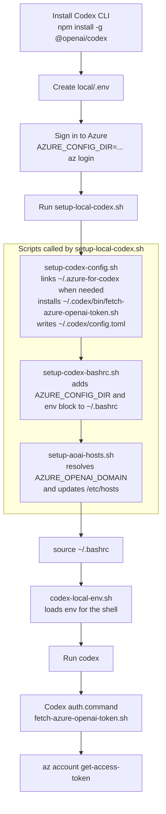

# Local Codex Setup (No Docker)

This local setup starts with installing the Codex CLI, then prepares the Azure auth path and applies the local Codex shell setup:

- install `@openai/codex`
- ensure `~/.azure-for-codex` exists
- install `~/.codex/bin/fetch-azure-openai-token.sh`
- write `~/.codex/config.toml`
- update `~/.bashrc`
- update `/etc/hosts`

The auth-helper install and config write happen together in `setup-codex-config.sh`, and a chained script runs the full setup in order.

## Setup Flow



## Scripts

- `local/scripts/setup-codex-config.sh`: installs `~/.codex/bin/fetch-azure-openai-token.sh`, links `~/.azure-for-codex` to `~/.azure` when needed, and writes `~/.codex/config.toml` for Azure OpenAI.
- `local/scripts/setup-codex-bashrc.sh`: adds a managed `codex-launch` block to `~/.bashrc` that sets `AZURE_CONFIG_DIR` and sources the local env helper.
- `local/scripts/setup-aoai-hosts.sh`: resolves `AZURE_OPENAI_DOMAIN` and updates `/etc/hosts`.
- `local/scripts/fetch-azure-openai-token.sh`: template for the installed `~/.codex/bin/fetch-azure-openai-token.sh` helper used by Codex's `auth.command`.
- `local/scripts/setup-local-codex.sh`: runs `setup-codex-config.sh`, `setup-codex-bashrc.sh`, and `setup-aoai-hosts.sh` in that order.
- `local/scripts/codex-local-env.sh`: sourced by the managed `.bashrc` block to load env and keep shell-launched `codex` sessions in sync.

## Prerequisites

- Node.js and npm installed.
- Azure CLI installed: `az`
- `sudo` access (required for `/etc/hosts` update)

## 1. Install Codex CLI

```bash
npm install -g @openai/codex
```

## 2. Create local env config

```bash
cp local/.env.example local/.env
```

Set at least:

```env
AZURE_OPENAI_DOMAIN=RESOURCE-NAME.openai.azure.com
AZURE_OPENAI_ENDPOINT=https://RESOURCE-NAME.openai.azure.com
AZURE_OPENAI_DEPLOYMENT_NAME=your_deployment_name_here
```

## 3. Sign in to Azure profile

If you already use the default Azure CLI profile at `~/.azure`, the local setup script will create `~/.azure-for-codex -> ~/.azure` automatically when needed.

Otherwise, create and sign in to the dedicated profile explicitly:

```bash
mkdir -p "$HOME/.azure-for-codex"
AZURE_CONFIG_DIR="$HOME/.azure-for-codex" az login
```

## 4. Run all local setup steps (recommended)

```bash
AZURE_CONFIG_DIR="$HOME/.azure-for-codex" \
  ./local/scripts/setup-local-codex.sh
```

This step installs `~/.codex/bin/fetch-azure-openai-token.sh`, writes `~/.codex/config.toml`, updates `~/.bashrc`, and updates `/etc/hosts`.

## 5. Reload shell config

```bash
source ~/.bashrc
```

## 6. Start Codex

```bash
codex
```

Codex now refreshes the Azure token inside the app by calling the auth helper configured in `~/.codex/config.toml`.

Optional:

```bash
codex --yolo
```

## Run steps individually

```bash
./local/scripts/setup-codex-config.sh
./local/scripts/setup-codex-bashrc.sh
./local/scripts/setup-aoai-hosts.sh
```

## FAQ

### Codex was working earlier and now returns `401 Unauthorized`

In the current local setup, Codex refreshes the Azure token automatically through its provider auth command. A `401 Unauthorized` usually means the Azure CLI login behind that command has expired, or the current shell still needs the updated local env block.

Reload the shell first:

```bash
source ~/.bashrc
```

Then run Codex again:

```bash
codex
```

If the same auth error still appears, renew the Azure session and reload the shell one more time:

```bash
AZURE_CONFIG_DIR="$HOME/.azure-for-codex" az login
source ~/.bashrc
```

### How does automatic refresh from Codex work?

`setup-codex-config.sh` writes an Azure provider config that uses Codex's command-backed auth flow instead of only relying on `AZURE_OPENAI_API_KEY`.

The refresh path is:

1. Codex starts with `model_provider = "azure"` in `~/.codex/config.toml`.
2. `setup-codex-config.sh` installs `~/.codex/bin/fetch-azure-openai-token.sh` and points `[model_providers.azure.auth].command` at that user-local helper.
3. That helper runs `az account get-access-token --resource https://cognitiveservices.azure.com/ --query accessToken -o tsv` with `AZURE_CONFIG_DIR="$HOME/.azure-for-codex"`.
4. Codex refreshes that token automatically on its normal refresh interval, so you do not need to manually export `AZURE_OPENAI_API_KEY` for routine use.

## Notes

- Setup scripts load env from repo root `.env` (if present) and then `local/.env`.
- If `~/.azure-for-codex` is missing and `~/.azure` already exists, `setup-codex-config.sh` creates `~/.azure-for-codex -> ~/.azure`.
- `setup-codex-config.sh` installs the auth helper under `~/.codex/bin` so the Codex config does not depend on the repo staying at the same path.
- `setup-codex-bashrc.sh` is idempotent and replaces its managed block on re-run.
